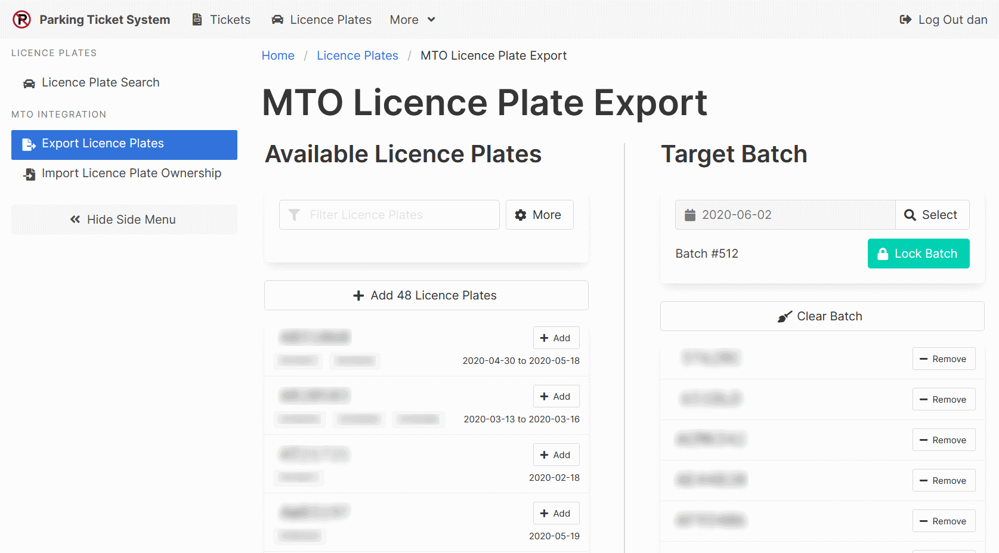
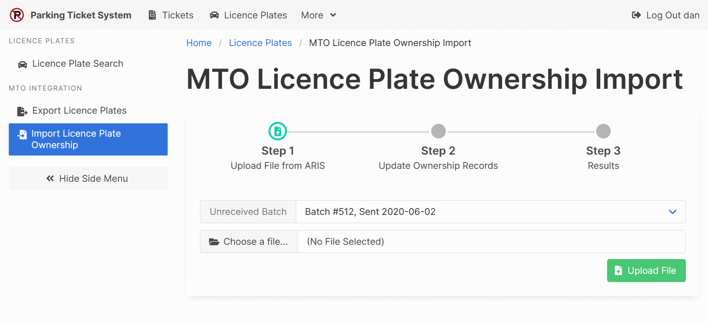

[Help Home](readme.md)

# Licence Plate Ownership Lookup (Ontario, Canada Only)

**Note that the section described below is for municipalities in Ontario, Canada.**
That is because it generates files that can be sent to the Ontario Ministry of Transportation (MTO).

## Export Licence Plates For Lookup

The MTO processes ownership lookup requests in overnight batches.
The MTO Licence Plate Export page generates those batches.

To get started, under the *Target Batch*, click "Select".
You can choose an existing batch that has not yet been locked
or a batch that has not yet had its results imported.
You can also create a new batch.

If the selected batch is unlocked, the *Available Licence Plates*
section will be populated.  Licence plates are automatically filtered in the following ways.

- Plates from Ontario, Canada.
- Plates from unresolved tickets.
- Plates not included in previous batches.

User available filters include a licence plate number search field,
and an option to only include plates from tickets issued seven or fourteen days ago.

Licence plates can be added to the batch one-by-one using the "Add" buttons.
Alternatively, all displayed licence plates can be added at the same time
by clicking the "Add All Licence Plates" button.

Licence plates added to a batch in error can be removed one-by-one
using the "Remove" buttons.  You can remove all of the licence plate numbers
from a batch by clicking the "Clear Batch" button.

Once you are satisfied with your batch, click the "Lock Batch" button.
Locked batches can be downloaded in a format compatible with
the Authorized Requester Information Services (ARIS) website, provided by MTO.

## Import Ownership Lookup Results

Results of ownership lookups from the MTO can be uploaded on the
MTO Licence Plate Ownership Import page.
Once uploaded, the ownership records can be reconciled with their related parking tickets
on the [Ownership Reconciliation](tickets-ownershipReconciliation.md) page.

## Related Documentation

- [Ownership Reconciliation](tickets-ownershipReconciliation.md)
