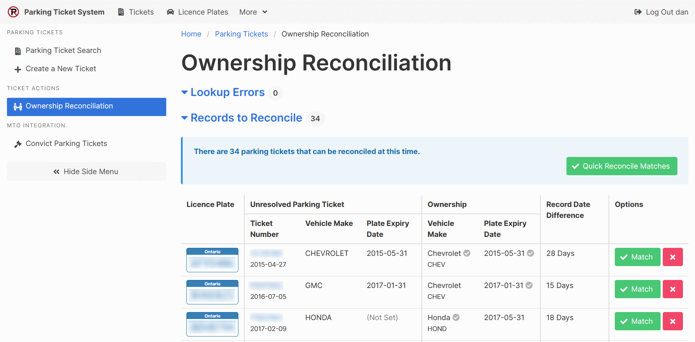

[Help Home](readme.md)

# Ownership Reconciliation

The Ownership Reconciliation page matches up ownership data retrieved from sources like
Ontario's Ministry of Transportation with parking ticket records.
Although retrieving records is quite specific to the country and province of the licence plate,
the reconciliation process is the same for all licence plates.

The **Lookup Errors** section displays problems that occurred while attempting
to retrieve ownership information for a particular licence plate.
Some reasons for errors include invalid licence plate numbers, or inactive licence plates.

The **Records to Reconcile** section shows parking ticket records
matched with the nearest future ownership records.
The following information is shown to help with reconciling records.

- Licence Plate Number

- Unresolved Parking Ticket Details
  - Parking Ticket Number and Issue Date
  - Vehicle Make
  - Licence Plate Expiry Date

- Ownership Information

  - Vehicle Make
    (When the vehicle make on the parking ticket matches the vehicle make on the ownership,
      a checkmark is shown.)

  - Licence Plate Expiry Date
    (When the expiry date on the parking ticket matches the expiry date on the ownership,
      a checkmark is shown.)

- Record Date Difference
  (The number of days between the date when the ticket was issued
    and the date when the ownership information was retrieved.)

Each row can be considered individually.
If the details on the parking ticket are considered to match the ownership details,
the corresponding green **Match** button should be selected.
If there is a significant discrepancy, the red **X** button should be selected.

Alternatively, records with matching vehicle makes and licence plate expiry dates
can be quickly reconciled together using the green **Quick Reconcile Matches** button.

## Related Documentation

- [Licence Plate Ownership Lookup](platesOntario-ownershipLookup.md) *(Ontario, Canada Only)*
- [Parking Tickets](tickets.md)
