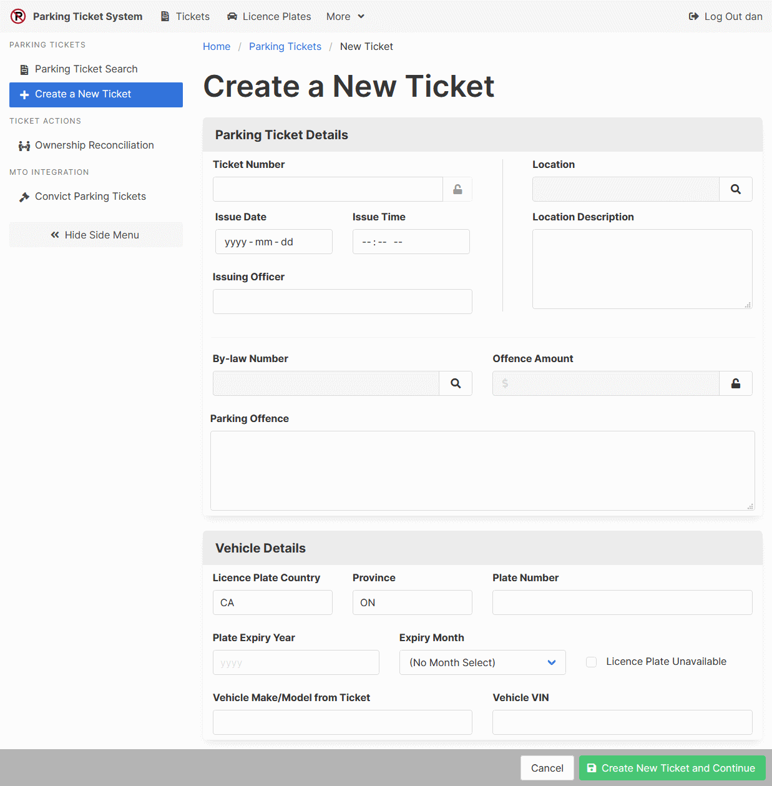
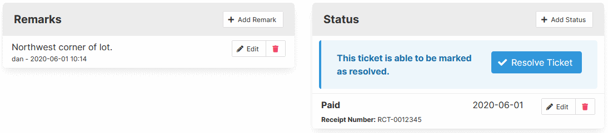
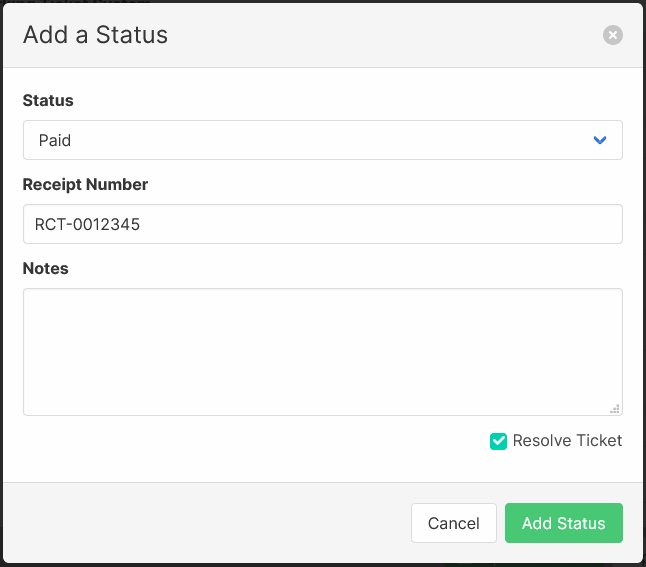

[Help Home](readme.md)

# Parking Tickets

The primary purpose of the Parking Ticket System is to manage municipal parking tickets
from the time they are registered to the time they are resolved.

## Finding a Parking Ticket

The Parking Ticket Search is the main way to find parking ticket records.
You can get to it from the main dashboard or from the Tickets link at the top of every page.

The search offers the following filters:

-   Ticket Number
-   Licence Plate Number
-   Location
-   Resolution Status (Unfiltered, Unresolved, or Resolved)

Selecting any ticket number will open the parking ticket record.

## Creating a Parking Ticket Record

Parking ticket records keep track of all the important details.
Complete the form, and click "Create New Ticket and Continue" to save the record.

An details of some of the key fields.

### Parking Ticket Number

You can use the config file to customize this field.

-   You can change the name of this field.
-   You can make the value unique, so the same parking ticket number cannot be used more than once.
-   You can apply a regular expression to the field, so the value must match a pattern.
-   You can define the `nextTicketNumberFn()` function to assist with entering sequential ticket numbers.

### Location

The location values are defined in the [Parking Locations admin section](locations.md).
Click the Search button to open a selection window.

### By-Law Number

The by-law values are defined in the [Parking By-Laws admin section](bylaws.md).
Click the Search button to open a selection window.
The by-laws available are filtered using the [parking offence records](offences.md),
which relate the locations with the by-laws, and provide the Offence Amount.

### Licence Plate Country and Province

The country and province codes can use default values defined in the config file.
To make use of the Ontario, Canada functionality, the country code should be **CA**
and the province code should be **ON**.

### Licence Plate Expiry Year and Month

The expiry date field is split across a year field and a month field.
The fields can either both be populated, or both left blank.
When split, the expiry date defaults to the last day of the selected month.
A setting in the config file can change the two fields into a single date field.

### Licence Plate Unavailable

When selected, the licence plate country, province, and number fields will no longer be required.

## Maintaining Parking Ticket Records

Once a parking ticket record has been created, two additional sections are added at the bottom.

The **Remarks** section is essentially a comment log to go along with the ticket.
It can include any extra information associated with the ticket that does not fit anywhere else.

The **Status** section is used to track the progression of tickets from entry to resolution.
The available statuses can be customized.
Some statuses can be set by a user, while others can only be set by other areas of the application,
like the [ownership reconciliation section](tickets-ownershipReconciliation.md).
Some statuses can resolve the parking ticket, while others can not.

The default statuses track when tickets are pending
[ownership lookups](platesOntario-ownershipLookup.md), paid, withdrawn, and convicted.

When adding a status to a parking ticket that is able to resolve the ticket,
an option will be included in the add window to resolve the ticket immediately.

Alternatively, if an unresolved ticket includes a resolvable status,
an option to resolve the ticket will be shown in the status section.

Once resolved, the ticket will be locked to prevent future changes.
If the ticket is resolved in error, the ticket can be unresolved for a short period of time afterwards.

## Related Documentation

-   [Ownership Reconciliation](tickets-ownershipReconciliation.md)
-   [Convict Parking Tickets](ticketsOntario-convict.md) _(Ontario, Canada Only)_
