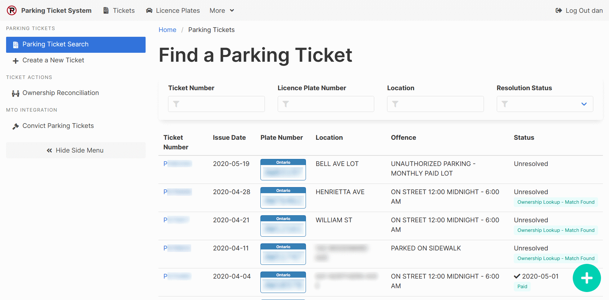

[Help Home](readme.md)

# Parking Tickets

The primary purpose of the Parking Ticket System is to manage municipal parking tickets
from the time they are registered to the time they are resolved.

## Finding a Parking Ticket

The Parking Ticket Search is the main way to find parking ticket records.
You can get to it from the main dashboard or from the Tickets link at the top of every page.

The search offers the following filters:

- Ticket Number
- Licence Plate Number
- Location
- Resolution Status (Unfiltered, Unresolved, or Resolved)

Selecting any ticket number will open the parking ticket record.

## Creating a Parking Ticket Record

## Related Documentation

- [Ownership Reconciliation](tickets-ownershipReconciliation.md)
- [Convict Parking Tickets](ticketsOntario-convict.md) *(Ontario, Canada Only)*
